# TP Docker — MySQL + Java App Server
## Datos del alumno
- Nombre: Groizard Facundo Tomas
## 1. ¿Qué es Docker?
... Docker es una plataforma de contenedorización que permite empaquetar una aplicación y todas sus dependencias (librerías, configuraciones, entorno de ejecución) en varios contenedores si se quisiese
## 2. Volúmenes en Docker
... Los contenedores son, por naturaleza, efímeros: si el contenedor se borra, los datos generados en su interior desaparecen. Los volúmenes son el mecanismo para persistir datos. Permiten conectar una carpeta del sistema anfitrión (tu PC o servidor) con una carpeta dentro del contenedor
## 3. Redes en Docker
... Docker permite crear redes virtuales para que los contenedores se comuniquen entre sí. Al usar un archivo docker-compose.yml, se crea automáticamente una red interna donde cada contenedor puede "ver" a otros usando simplemente el nombre del servicio como dirección (hostname), aislando el tráfico del exterior
## 4. ¿Por qué Payara Server?
... Payara Server sirve como el "motor" o la plataforma que ejecuta aplicaciones empresariales escritas en Java. Si Docker es el contenedor que transporta la carga, Payara es la infraestructura dentro de ese contenedor que hace que la aplicación funcione, se comunique y escale
## 5. Explicación del docker-compose.yml
... El archivo docker-compose.yml es el "director de orquesta". En lugar de ejecutar comandos largos para cada contenedor, este archivo YAML define: Servicios, Puertos, Entorno, Depends_On (Servicios Esenciales que arrancan antes que lo de mas)
## 6. Explicación del init.sql
... Cuando se levanta un contenedor de base de datos (como PostgreSQL o MySQL) por primera vez, Docker busca scripts en una carpeta específica (habitualmente /docker-entrypoint-initdb.d/). El archivo init.sql contiene las sentencias DDL y DML iniciales par: Crear las tablas necesarias, Insertar datos de prueba o configuración inicial, Definir roles y permisos
## 7. Dificultades y soluciones
Sincronización de arranque: A veces Payara intenta conectar a la BD antes de que esta haya terminado de inicializarse [ Solución: Implementar políticas de reintento en el pool de conexiones o usar scripts de "wait-for-it" ]

Permisos de archivos: En Linux, los volúmenes pueden tener problemas de escritura [ Solución: Ajustar el UID/GID en el archivo compose para que coincida con el usuario del contenedor ]

Conectividad JDBC: Errores en la URL de conexión [ Solución: Asegurarse de usar el nombre del servicio definido en el compose (ej. jdbc:postgresql://db:5432/mi_bd) en lugar de localhost ]

# Capturas de Pantalla Obligatorias

## **Parte 1 — Infraestructura Docker (5 capturas)**

## 1. Salida de docker --version y docker info en la terminal
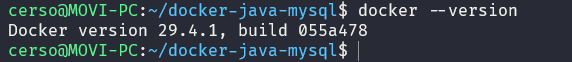
## 2. Salida de docker network ls mostrando la red java-net
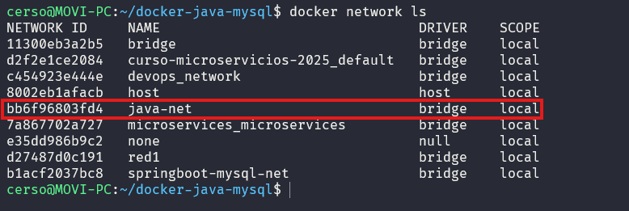
## 3. Salida de docker volume inspect mysql-data
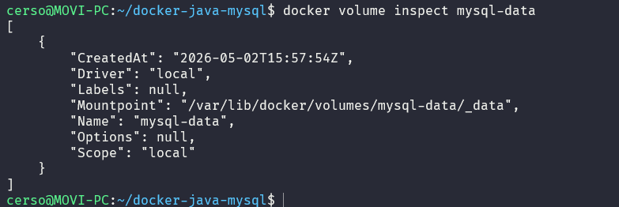
## 4. Salida de docker ps con ambos contenedores activos
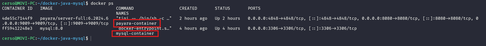
## 5. docker network inspect java-net con ambos contenedores en la red
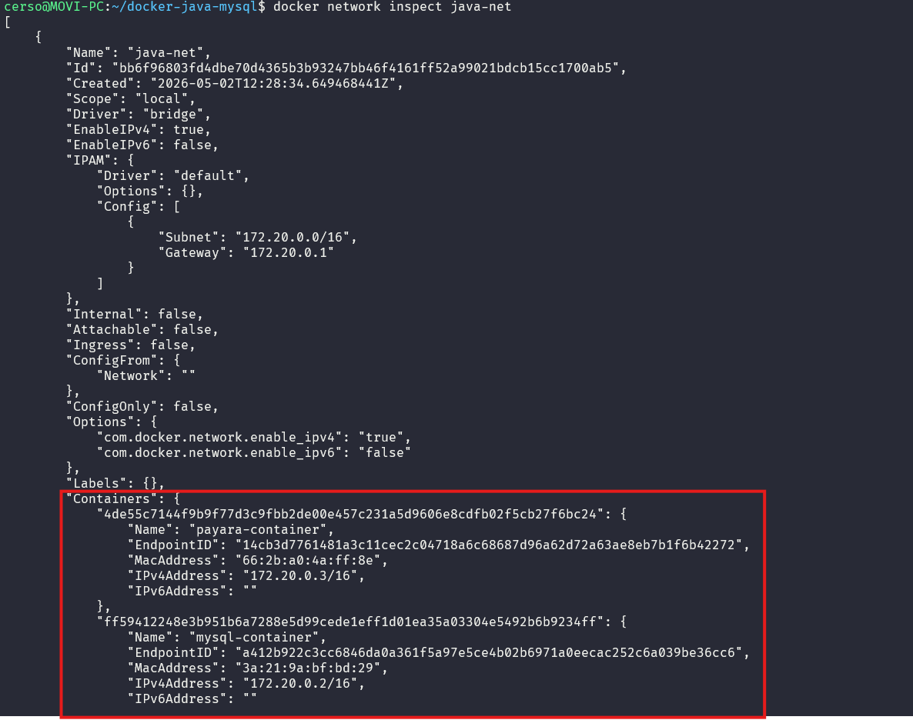

## **Parte 2 — MySQL (3 capturas)**
## 6. Logs de MySQL mostrando: ready for connections
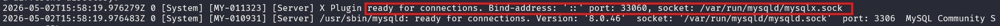
## 7. Salida de SHOW DATABASES; mostrando la base appdb
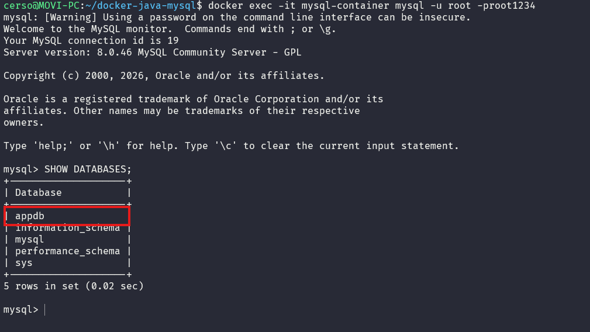
## 8. Salida de SELECT * FROM usuarios; con los datos del init.sql

## **Parte 3 — Payara Admin Console / GUI (5 capturas)**
## 9. Pantalla de login de Admin Console en http://localhost:4848
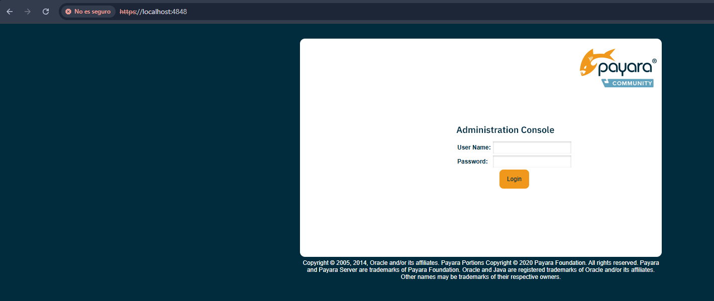
## 10. Dashboard principal de Payara tras iniciar sesión
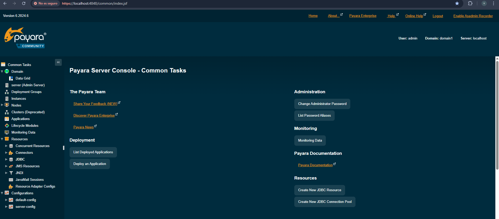
## 11. Pantalla del Connection Pool MySQLPool creado
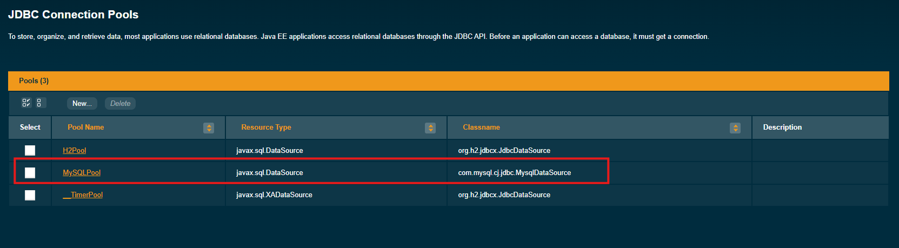
## 12. Resultado del botón Ping mostrando conexión exitosa a MySQL
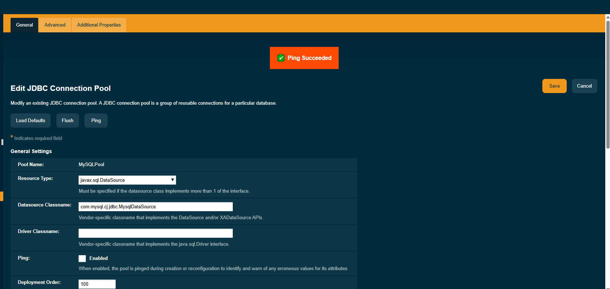
## 13. JDBC Resource jdbc/MySQLDS visible en la consola
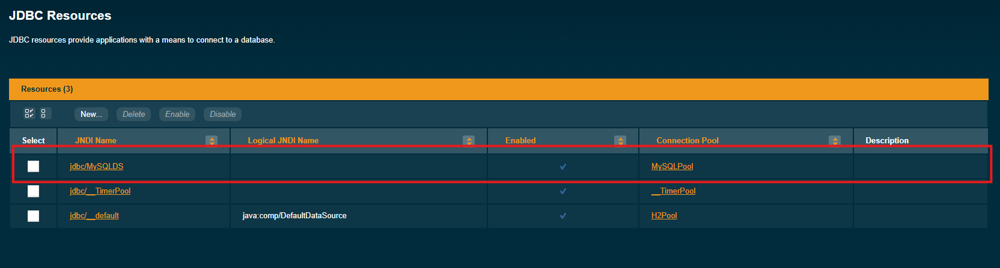

## Parte 4 — Conectividad entre contenedores (1 captura)
## 14. Salida del ping de Payara hacia mysql-container desde la terminal
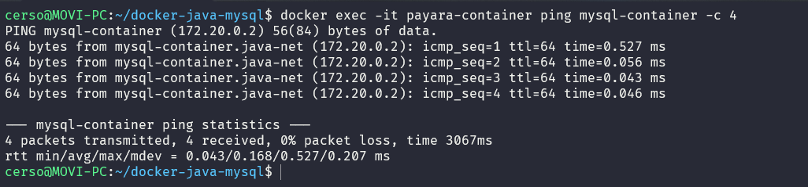

